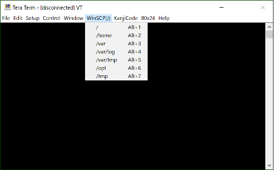

# TeraTerm Plug-in

  - [TTXWinSCP.dll](https://github.com/hkanou/TTXSamples/tree/main/Release) -- WinSCP Launcher  
    [Usage](https://github.com/hkanou/TTXSamples/blob/main/TTXWinSCP), [Usage(ja)](https://github.com/hkanou/TTXSamples/blob/main/TTXWinSCP/ReadMe-ja.txt)  
    system requirements : [Tera Term 5](https://teratermproject.github.io/), [WinSCP](https://winscp.net/eng/download.php)  
    

## Compiler

  Visual Studio Express 2017
